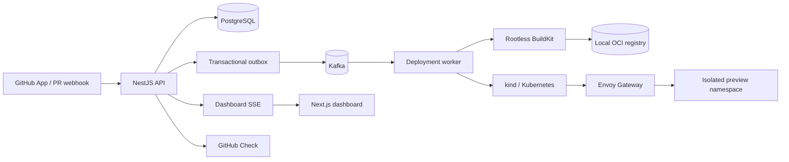

# PreviewForge teknik çalışma raporu

Bu rapor PreviewForge'un ne yaptığını, parçaların nasıl konuştuğunu, bir pull
request'in hangi aşamalardan geçtiğini ve local M9 kabulünün neyi kanıtladığını
anlatır. Amaç yalnızca dosya listesi vermek değil; sistemin neden bu şekilde
kurulduğunu anlaşılır hale getirmektir.

## 1. Ürün fikri

PreviewForge bir pull request için geçici bir uygulama adresi üretir. Kullanıcı
bir PR açtığında sistem:

1. GitHub olayını doğrular.
2. PR'ın tam commit SHA'sı için bir deployment kaydı oluşturur.
3. Repository Dockerfile'ını BuildKit ile image'a çevirir.
4. Image'ı immutable digest ile registry'ye gönderir.
5. Kubernetes'te yalnızca o preview'a ait bir namespace ve workload oluşturur.
6. Envoy Gateway üzerinden hostname routing ve HTTP health check yapar.
7. Sonucu dashboard'a, live log akışına ve GitHub Check'e taşır.
8. PR kapandığında namespace'i siler.

Bu, "GitHub'a push gelince otomatik local preview" akışıdır. PreviewForge
henüz production deployment platformu veya genel amaçlı Kubernetes manifest
çalıştırıcısı değildir.

## 2. Büyük resim



Her kutunun anlamı:

| Katman | Kod/servis | Sorumluluk |
|---|---|---|
| Kullanıcı arayüzü | `apps/web` | Sign-in, App kurulumu, repository import, deployment history, stage ve log gösterimi |
| Control plane | `apps/api` | Auth/session, GitHub callback, raw webhook, project ayarları, dashboard API ve SSE |
| Kalıcı veri | PostgreSQL | Kullanıcı, installation, project, PR, desired SHA, deployment, log, outbox ve cleanup durumu |
| Mesajlaşma | Kafka | API ile worker arasındaki at-least-once event/command akışı |
| Orkestrasyon | `apps/worker` | Source acquisition, build/push, Kubernetes reconcile, health, Check Run ve cleanup |
| Build güvenlik sınırı | Rootless BuildKit | Kullanıcı Dockerfile'ını Docker socket veya `--privileged` olmadan çalıştırmak |
| Image deposu | OCI registry | BuildKit'in push ettiği digest ve layer'larını kind'ın çekebilmesini sağlamak |
| Runtime | kind + Kubernetes | Preview namespace ve workload'larını çalıştırmak |
| Giriş katmanı | Envoy Gateway | Hostname'e göre doğru preview Service'ine yönlendirmek |

## 3. Bir PR'ın uçtan uca yaşamı

### 3.1 Webhook kabulü

GitHub `pull_request` event'i API'ye gelir. API önce imzayı parse edilmiş
JSON'da değil, **ham request body** üzerinde doğrular. `X-GitHub-Delivery`
benzersiz anahtar olarak PostgreSQL'e yazılır. Aynı delivery tekrar gelirse
ikinci deployment üretilmez.

Payload normalize edildikten sonra repository'nin daha önce dashboard'dan
import edilmiş olması gerekir. API, PR'ın desired commit SHA'sını ve
deployment isteğini transaction içinde yazar; aynı transaction outbox event'i
de üretir. GitHub'a verilen `201` cevabı deployment'ın bittiği anlamına gelmez;
işin kalıcı olarak kabul edildiği anlamına gelir.

### 3.2 Outbox ve Kafka

PostgreSQL kaynak gerçekliğidir. API'nin DB'ye yazıp Kafka'ya gönderemeden
çökmesi durumunda outbox relay event'i daha sonra tekrar yayınlar. Kafka
mesajları at-least-once olduğu için worker aynı mesajı birden fazla kez
görebilir; durable receipt, claim lease ve state guard'ları duplicate geçişi
engeller.

Deployment event'leri environment ID ile partition edilir. Böylece aynı
preview'ın event'leri mümkün olduğunca sıralı kalır; yine de consumer geç veya
tekrar gelen mesajı güvenlik kontrolleriyle ele alır.

### 3.3 Worker lease ve source acquisition

Worker deployment için kısa süreli bir claim/lease alır. GitHub installation
token'ı yalnızca source archive ve Dockerfile'ı almak için kullanılır. Token
build context'e, image layer'ına, preview environment'a veya log'a aktarılmaz.
Source alındıktan sonra build trust zone'undan çıkarılır.

### 3.4 Rootless BuildKit build ve digest

Worker `BUILDKIT_ADDR=unix:///.../buildkitd.sock` üzerinden dedicated rootless
BuildKit'e bağlanır. Docker socket kullanılmaz. BuildKit Dockerfile'ı çalıştırır,
image'ı local registry'ye push eder ve bir `sha256:...` digest döndürür.
Kubernetes'e mutable tag yerine bu digest verilir.

Local M9 host kanıtı:

- Socket: `/var/tmp/previewforge-buildkit/buildkitd.sock`
- Client group: `emir`, socket mode `0660`
- Worker: `mznlwmqkfsx16ehxgrx4yndop`
- Platformlar: `linux/amd64`, `linux/amd64/v2`, `linux/amd64/v3`, `linux/386`
- RootlessKit child namespace ve UID/GID map doğrulandı.

M4/M9 tasarımının nedeni, kullanıcı Dockerfile'ının build sırasında keyfi
komutlar çalıştırabilmesidir. Rootless sınır host etkisini azaltır; bu tek
başına hostile public multi-tenant garantisi değildir.

### 3.5 Kubernetes reconcile

Worker her preview için internal environment ID'den türetilen bir namespace
adı kullanır. Namespace içinde yalnızca platformun beklediği namespaced
kaynaklar bulunur:

```text
Namespace
├── ResourceQuota
├── LimitRange
├── default-deny NetworkPolicy + açık izinler
├── ServiceAccount (automountServiceAccountToken=false)
├── Secret (yalnızca environment variable varsa)
├── Deployment (immutable image digest)
├── Service
└── HTTPRoute -> platform Gateway
```

Kaynaklar ownership label'ları, project/environment/deployment kimlikleri ve
expiry metadata taşır. Cleanup sırasında worker önce ownership ve kimlik
koşullarını kontrol eder; yanlış sahibin namespace'i silinmez.

### 3.6 Health check ve routing

Platform Gateway `default/previewforge` altında ortak altyapı kaynağıdır.
Preview yalnızca kendi namespace'inden bir `HTTPRoute` üretir. Route hostname'i
şudur:

```text
preview-<environment-id>.preview.localhost
```

Local browser URL'si Gateway loopback portunu ekler:

```text
http://preview-<environment-id>.preview.localhost:18080/health
```

`18080` HTTPRoute kimliğinin parçası değildir; host makinedeki Envoy
port-forward'ıdır. Worker health check sırasında aynı hostname'i kullandığı için
Envoy doğru route'u görür. M9'un son düzeltmesi bu URL'yi shared preview URL
contract'ından otomatik üretir; `PREVIEWFORGE_HEALTHCHECK_URL_TEMPLATE` yalnızca
özel override olarak kalır.

`Accepted=True` ve `ResolvedRefs=True` route koşulları ile doğru Host'tan HTTP
200 birlikte görülmeden deployment `READY` sayılmaz. Yanlış Host için beklenen
cevap `404`'tür.

## 4. Deployment state machine

```text
QUEUED
  -> CLONING
  -> BUILDING
  -> PUSHING
  -> DEPLOYING
  -> WAITING_FOR_HEALTHCHECK
  -> READY
```

Terminal veya yarış sonucu durumları:

| Durum | Anlamı |
|---|---|
| `READY` | Workload available ve health check başarılı |
| `FAILED` | Stage, stable error code, redacted message ve retryability kaydedildi |
| `SUPERSEDED` | Environment'ın desired SHA'sı daha yeni commit'e değişti |
| `CANCELLED` | Kontrollü iptal sonucu durduruldu |

Desired SHA ana concurrency otoritesidir. Worker clone, push, Kubernetes
mutation ve `READY` yayınından önce deployment SHA'sının hâlâ environment'ın
desired SHA'sı olduğunu kontrol eder. Eski commit'in build'i tamamlanmış olsa
bile yeni commit'in preview'ını üzerine yazamaz.

## 5. PostgreSQL'de neler tutulur?

Başlıca kayıtlar:

- **User/session:** dashboard kimliği ve session yaşamı.
- **Installation/project:** GitHub App installation sahipliği ve import edilen repository ayarları.
- **Pull request/environment:** PR numarası, desired commit SHA'sı ve preview kimliği.
- **Deployment:** stage, attempt, digest, başlangıç/bitiş, hata ve supersession bilgisi.
- **Webhook delivery:** delivery ID, payload hash, duplicate/stale sonucu.
- **Outbox/receipts:** event'in yayınlanması ve consumer'ın idempotency durumu.
- **Log chunks:** bounded, redacted build/deploy log parçaları ve SSE cursor'ları.
- **Environment deletion:** close/TTL cleanup isteği, processing ve completion durumu.

Dashboard history bu kayıtların bir kısmını ürün geçmişi olarak tutar. Kubernetes
namespace'i veya running process gibi ephemeral kaynakların silinmesi, DB'deki
ürün geçmişinin silinmesiyle aynı şey değildir.

## 6. Local runtime ne başlatır?

`pnpm local:up` tek bir sahiplik işareti ve state dizini altında şu yolu yönetir:

1. Docker context ve host tool'larını kontrol eder.
2. Compose ile PostgreSQL, Kafka ve registry'yi hazırlar.
3. Prisma migration'larını uygular.
4. kind cluster'ı oluşturur veya kabul edilen mevcut cluster'ı kullanır.
5. Envoy Gateway ve platform Gateway'i hazırlar.
6. Registry'yi kind node'larına bağlar.
7. Gateway loopback port-forward'ını açar.
8. API, worker ve web'i `pnpm dev` üzerinden başlatır.
9. Tüm readiness sınırları geçmeden başarılı çıkmaz.

`pnpm local:status` yalnızca redacted process/port/boundary durumunu gösterir.
`pnpm local:down` yalnızca bu runtime'ın kaydettiği process group, Compose
container ve kendisinin oluşturduğu kind cluster kaynaklarını durdurur.

Varsayılan local portlar:

| Sınır | Port/adres |
|---|---|
| Dashboard | `localhost:3000` |
| API | `localhost:4000` |
| Gateway | `127.0.0.1:18080` |
| PostgreSQL | `localhost:55432` |
| Kafka | `localhost:59092` |
| Registry | `localhost:55000` |
| BuildKit | `/var/tmp/previewforge-buildkit/buildkitd.sock` |

## 7. Browser ve GitHub fixture

Controlled fixture loopback'te `127.0.0.1:43129` adresinde çalışır. OAuth,
installation, repository listesi, Dockerfile/source archive, Check Run ve
webhook endpoint'lerini sentetik olarak sağlar. Bu fixture gerçek GitHub hesabı
ve public tunnel gerektirmez; buna rağmen API'nin HMAC, ownership, desired-SHA,
digest ve policy sınırlarını atlamaz.

M9 browser proof'unda dashboard şunları gösterdi:

- Authenticated owner session (`Sign out` görünür).
- Imported `previewforge/m9-fixtures` project.
- `PR #12 ACTIVE` ve `READY` deployment.
- Immutable image digest ve live BuildKit logları.
- `Open preview` linki.

Link açıldığında browser tab'ı generated preview hostname'inde
`PreviewForge M9 local demo fixture` metnini aldı.

## 8. M9 kabul kanıtı

M9 local product acceptance raporu aşağıdakileri gerçek local bağımlılıklarla
kanıtladı:

| Kanıt | Sonuç |
|---|---|
| Rootless BuildKit worker/socket | Geçti |
| `pnpm local:up/status/down` | Geçti |
| PR12 gerçek build/push | `READY`, immutable digest |
| kind workload | Pod `1/1 Running`, Deployment `1/1 Available` |
| Envoy route | `Accepted=True`, `ResolvedRefs=True` |
| Doğru Host | HTTP `200`, fixture JSON |
| Yanlış Host | HTTP `404` |
| Browser journey | Dashboard -> `Open preview` -> fixture tab |
| Webhook negatif kontroller | invalid signature `401`, duplicate ve stale kontrolleri geçti |
| Close cleanup | PR9–PR12 deletion request'leri tamamlandı |
| Residue | Managed namespace ve local runtime state yok |
| Repository gate | `pnpm check`, `pnpm docs:check`, `git diff --check` geçti |

Ayrıntılı ham acceptance kanıtı [M9 local product report'unda](session-2026-09-20-m9-local-product.md)
bulunur.

## 9. Güvenlik ve hata modelleri

### Doğrulanan davranışlar

- Raw-byte HMAC verification ve delivery deduplication.
- At-least-once outbox/Kafka tüketimi için durable guard'lar.
- Desired-SHA fencing ve stale work supersession.
- Build credential boundary: source token build trust zone'unda değil.
- Rootless BuildKit ve Unix socket; Docker socket/TCP listener yok.
- Digest-only deploy.
- Restricted workload kaynakları ve ownership-safe deletion.
- Bounded, redacted logs; secret değerleri API/read response'larına dönmez.
- Retry stage/error code'a göre sınıflıdır; user build failure körlemesine retry edilmez.

### Bilerek kapsam dışında bırakılanlar

- AWS EKS/ECR ve production provisioning.
- Public hostile multi-tenant güvenlik garantisi.
- Multi-container application, persistent volume, user database veya Redis.
- Production RBAC/CNI kanıtı; local kind acceptance bunu kanıtlamaz.
- Arbitrary Helm/Kubernetes manifest çalıştırma.

## 10. Dosyaları nasıl okuyabilirsin?

- Ürün sınırı: [MVP scope](../product/mvp-scope.md)
- Bileşen sınırı: [system design](../architecture/system-design.md)
- State transition'lar: `packages/contracts/src/deployment.ts`
- API webhook doğrulaması: `apps/api/src/webhooks/`
- Worker build/deploy: `apps/worker/src/build/` ve `apps/worker/src/kubernetes/`
- Runtime supervisor: `scripts/local/runtime.mjs`
- Local Compose: `infrastructure/local/compose.yaml`
- Kind/Gateway: `infrastructure/kubernetes/` ve `scripts/kubernetes/`
- Rootless host boundary: [ADR 0004](../architecture/decisions/0004-rootless-buildkit.md)
- Gateway kararı: [ADR 0003](../architecture/decisions/0003-gateway-api.md)

## 11. Kalan işler

Local M9 için zorunlu iş kalmadı. Roadmap'deki tek aktif başlık M10 AWS
EKS/ECR cloud demo'sudur; explicit maximum spend, billing alert, disposable
account/region ve destroy procedure onayı olmadan AWS preflight bile yapılmaz.

M10 açılmadan önce yapılmayacaklar:

- AWS credential veya account discovery.
- EKS/ECR provisioning.
- Cloud network/RBAC mutation.
- Local acceptance sonucunu cloud acceptance kanıtı gibi sunmak.

## Kaynaklar

- [README / kullanıcı özeti](../../README.md)
- [MVP scope](../product/mvp-scope.md)
- [System design](../architecture/system-design.md)
- [Local development runbook](../operations/local-development.md)
- [M9 execution plan](../plans/m9-local-product-experience.md)
- [M9 acceptance report](session-2026-09-20-m9-local-product.md)
- [Roadmap](../delivery/roadmap.md)
